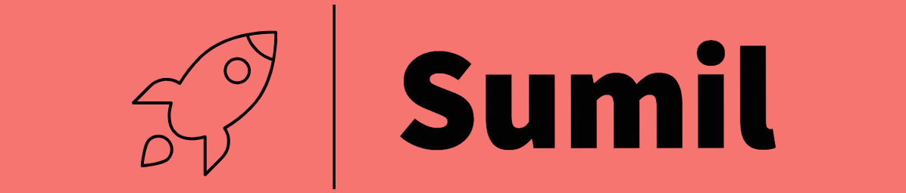
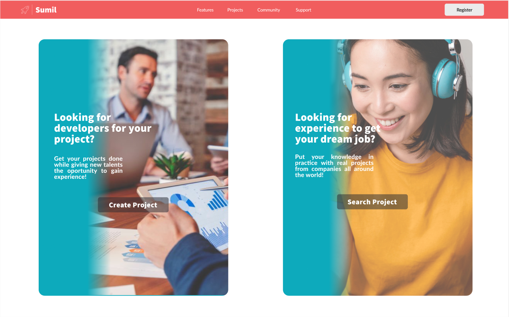
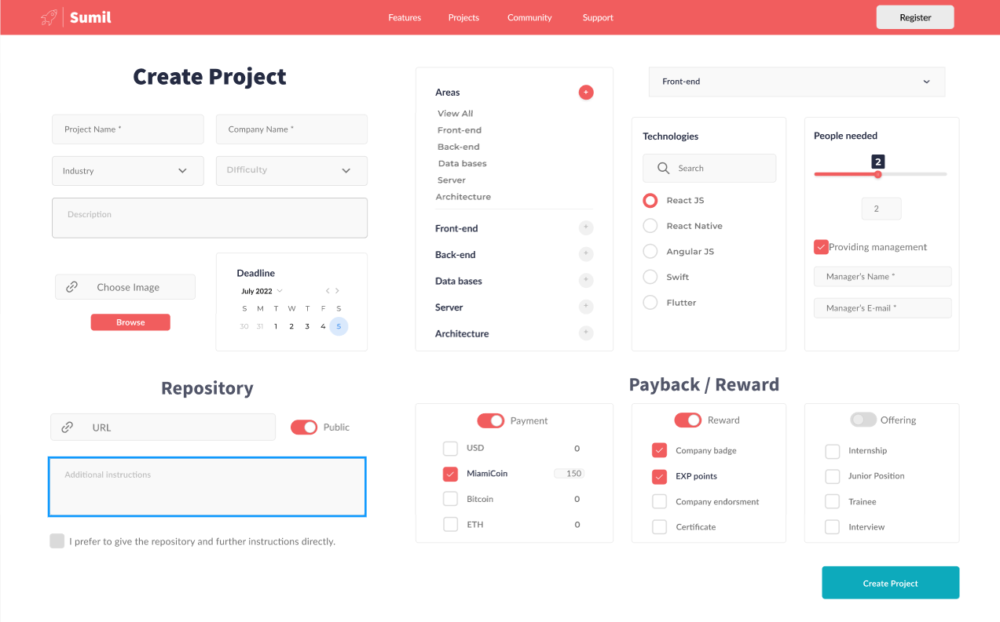
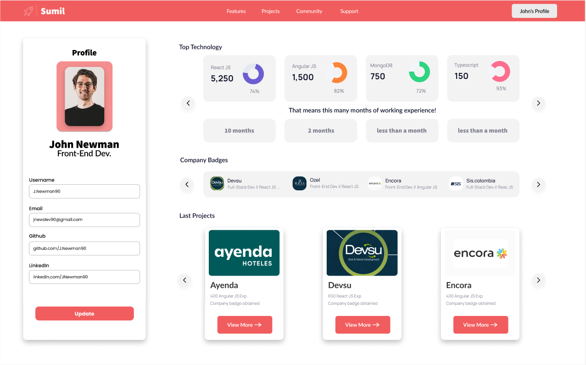
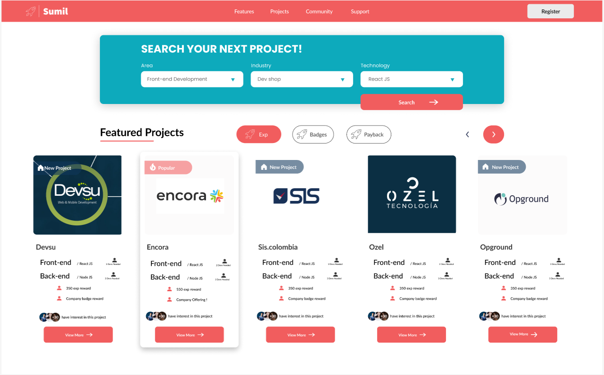

## Description :memo:
SUMIL is a platform in which anyone can gain experience in an exponential way :rocket:. It consists in a webpage where a person that wants to gain experience searches for tasks or small projects that companies have shared in exchange of points :arrow_up:, awards :trophy:, money :moneybag: or even Miamicoins :chart_with_upwards_trend:.

## Main objectives
* <b>Help</b> Software Engineers to gain experience
* <b>Facilitate</b> business recognition and employability for bootcamp students, recent graduates, senior citizens, etc
* <b>Assist</b> companies with problems that do not require a permanent employee  
* <b>Familiarize</b> engineers to a working environment
* <b>Increase</b> your salary income in free time


## Technologies
* Python :snake:
* FatsAPI :zap:
* Mongo :leaves:


## File description
* *.env* file with the user and passwod to access the database
* *project.py* Object model for project's
* *developer.py* Object model for developer's
* *company.py* Object model for company's
* *api_integration.py* API routes and github integration to obtain information from repos

## How to use - Company side :office:
1) Access to our webpage

2) Create your profile
3) Upload a project

4) Check for stats
5) When someone finishes check their code
6) Reward them

## How to use - Developer side :computer:
1) Access to our webpage

2) Create your profile

3) Search for a project suited for you

4) Apply to the project
5) Code and do a pull request
6) Notify you have finished
7) Wait for an answer!

## Test
 ### Test the API
```
$ uvicorn api_integration:app --reload
```
On your browser search for: 
```
http://127.0.0.1:8000/docs
```


## Authors ✒️
<details  style="user-select: none;">
	<summary>
		<strong style="user-select: none;cursor: pointer;">Jessica Mercedes</strong> - <a href="https://www.linkedin.com/in/jessicamercedes/" target="_blank">linkedin</a>
	</summary>
</details>

<details  style="user-select: none;">
	<summary>
		<strong style="user-select: none;cursor: pointer;">Juan David Peña</strong> - <a href="https://www.linkedin.com/in/medranojdp/" target="_blank">linkedin</a>
	</summary>
</details>

<details  style="user-select: none;">
	<summary>
		<strong style="user-select: none;cursor: pointer;">Adriana Echeverri</strong> - <a href="https://www.linkedin.com/in/adriana-echeverri-4a807118a/" target="_blank">linkedin</a>
	</summary>
</details>
